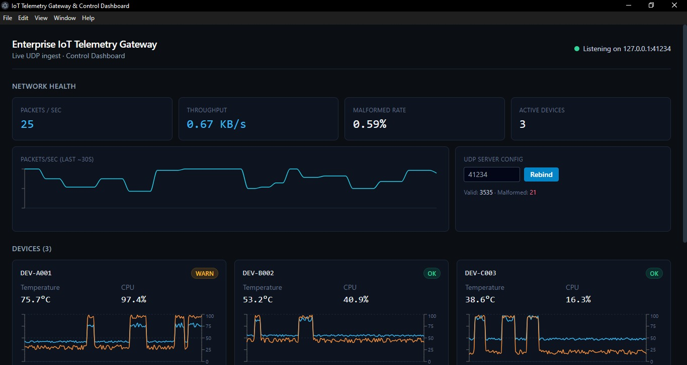
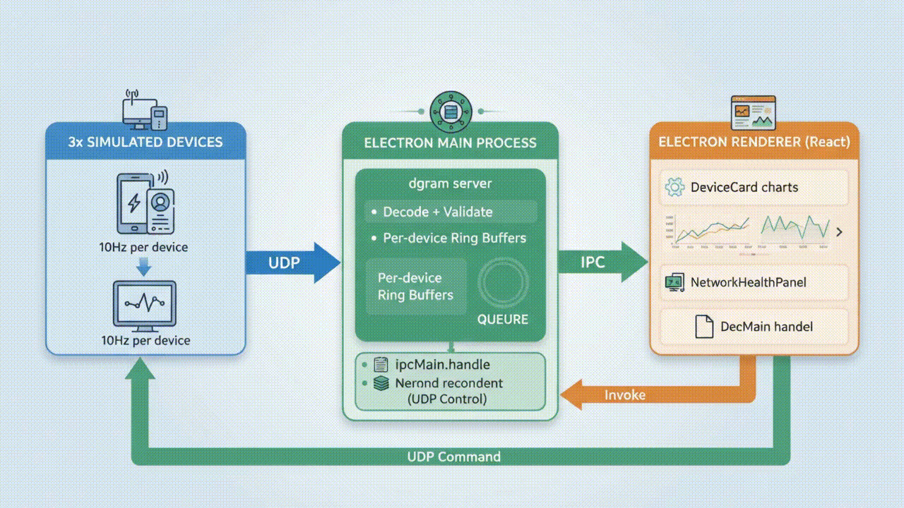

# Enterprise IoT Telemetry Gateway & Control Dashboard


An Electron desktop application that ingests high-frequency UDP telemetry from
simulated IoT devices, visualizes it live (Recharts), and dispatches
bidirectional UDP control commands back to devices — all through a
security-hardened `contextBridge` IPC layer.

Built to demonstrate: native `dgram` UDP networking in Node, Electron
main/renderer architecture done *correctly* under sustained high-frequency
load, and a real operational dashboard (throughput analytics, packet
integrity monitoring, CSV audit export) rather than a toy demo.

---

## Architecture



*Static architecture diagram with full details:*


*(For screen readers or text-based processing, a plain-text version is available in [ARCHITECTURE.md](./ARCHITECTURE.md))*

### The three engineering problems this project solves

**1. GC pressure from high-frequency packet parsing** (`shared/packetSchema.js`)
Telemetry is sent as a **fixed 27-byte binary layout**, not JSON — this avoids
allocating a new string + object per packet on the hot ingest path, and the
fixed size doubles as free structural validation (wrong length = malformed,
independent of a checksum byte that also catches corruption). History is
stored in a **bounded ring buffer** (`shared/ringBuffer.js`) per device, so
memory is flat over time regardless of how long the gateway runs — there is
no unbounded `array.push()` anywhere on the ingest path. Control commands
(low frequency, operator-triggered) deliberately stay JSON, since
readability/loggability matters more than allocation cost there.

**2. IPC bottleneck (main → renderer)** (`electron/main.js`)
The UDP server never sends one IPC message per packet. Incoming packets are
queued into `pendingBatch` and flushed to the renderer on a single fixed
interval (`IPC_FLUSH_INTERVAL_MS`, default 100ms — see `shared/config.js`).
Ingest rate and IPC call frequency are fully decoupled: the gateway could
ingest at 10x the rate and the renderer would still receive exactly one
message per 100ms.

**3. UI responsiveness under continuous updates** (`src/App.jsx`)
The renderer adds a *second* decoupling layer on top of IPC batching:
incoming batches are written into `useRef` buffers (no re-render), and a
separate `setInterval` (`COMMIT_INTERVAL_MS`, 500ms) drains those refs into
React state. Chart data arrays are capped (`src/lib/capArray.js`) so
Recharts is never handed a growing array. Net effect: ingest can spike
arbitrarily and the UI keeps rendering at a fixed, human-perceptible 2fps
state-commit rate.

### Wire protocol

See the header comment in `shared/packetSchema.js` for the full byte layout.
Short version: `[magic][deviceId:8][timestamp:f64][temperature:f32][cpuUsage:f32][status][checksum]`
= 27 bytes, big-endian, XOR checksum over all preceding bytes.

### Security

`contextIsolation: true`, `nodeIntegration: false`, `sandbox: true` in
`electron/main.js`. The renderer's *only* access to Node/Electron APIs is the
explicit, typed surface exposed in `electron/preload.js` via
`contextBridge.exposeInMainWorld('gatewayApi', ...)`.

---

## Project layout

```
electron-udp-gateway/
├── electron/
│   ├── main.js          # window bootstrap, UDP server, UDP control client, IPC handlers
│   └── preload.js        # contextBridge — the only API surface the renderer sees
├── shared/
│   ├── packetSchema.js   # binary telemetry codec (encode/decode + validation)
│   ├── ringBuffer.js      # bounded circular buffer (main-process history + CSV log)
│   └── config.js          # ports, flush interval, buffer sizes
├── src/                   # React renderer (Vite)
│   ├── main.jsx
│   ├── App.jsx            # IPC batching -> throttled state commit pipeline
│   ├── lib/capArray.js
│   └── components/
│       ├── DeviceCard.jsx          # per-device live dual-metric chart
│       ├── NetworkHealthPanel.jsx  # throughput, malformed rate, port config
│       ├── ControlPanel.jsx        # send UDP commands to a target device
│       └── LogsPanel.jsx           # malformed-packet audit log + CSV export
├── udp_simulator.js       # standalone test harness, see below
├── index.html / vite.config.js
├── exports/                # default landing spot mentioned in docs (CSV goes via Save dialog)
└── package.json
```

---

## Setup

Dependencies assumed already present per project brief: Node 20+, Electron
30+, React, Tailwind (loaded here via the Tailwind CDN script in
`index.html` — see note below), Recharts. If this is a fresh clone, run:

```bash
npm install
```

**Note on Tailwind:** this project loads Tailwind via the play-CDN
(`<script src="https://cdn.tailwindcss.com">` in `index.html`) rather than a
compiled PostCSS pipeline, to keep the build config minimal for a portfolio
project. Swap in a real PostCSS/Tailwind build step before shipping this to
production (the CDN build is not meant for production use).

**Note on dev tooling:** `concurrently`, `cross-env`, and `wait-on` are
listed as devDependencies to wire up the two-process dev workflow below. If
your environment doesn't already have them, `npm install` will fetch them
along with everything else.

---

## Running it

You need **two things running side by side**: the Electron dashboard, and
the UDP simulator feeding it data. They're independent processes — the
dashboard works standalone (it just shows "no telemetry yet") and the
simulator works standalone (it just logs what it sent).

### Terminal 1 — the dashboard

```bash
npm run dev
```

This starts the Vite dev server for the renderer and launches Electron
pointed at it (hot-reload for UI work). The Electron main process binds the
UDP telemetry server on `127.0.0.1:41234` on startup — watch the terminal
for `[udp-server] listening on udp://127.0.0.1:41234`.

For a production-style run instead (no Vite dev server):

```bash
npm run build      # builds the renderer to dist/
npm run start       # launches Electron loading dist/index.html
```

### Terminal 2 — the simulator

```bash
npm run simulator
# equivalent to: node udp_simulator.js
```

This streams 3 devices (`DEV-A001`, `DEV-B002`, `DEV-C003`) at 100ms
intervals to `127.0.0.1:41234`, and also opens a listener on
`127.0.0.1:41235` that stands in for each device's own command receiver —
so when you use the dashboard's **Control Panel** to send `REBOOT` / `PING`
/ `RESET_STATS`, you'll see it logged in this terminal as proof the
main-process UDP *client* path works, not just the server.

Optional flags: `node udp_simulator.js --port 41234 --host 127.0.0.1
--interval 100 --control-port 41235`.

### Verifying it's working

1. Dashboard shows the three devices appear within ~1-2 seconds, each with a
   live temperature/CPU chart and an `OK`/`WARN`/`CRITICAL` badge.
2. **Network Health** panel shows non-zero packets/sec and KB/s.
3. Occasionally (by design, ~0.7% of packets) you'll see the **malformed
   packet count** tick up and an entry appear in the **Audit Log** — this is
   the simulator intentionally corrupting packets to exercise the
   checksum-validation path.
4. Occasionally a device will go **OFFLINE** for a couple of seconds (a
   simulated dropout) and a device will spike into **WARN**/**CRITICAL**
   (a simulated overheat/CPU-pegged event) — both are intentional anomaly
   injection in `udp_simulator.js`, to give the dashboard's status logic
   something real to react to.
5. In **Device Control**, send a `REBOOT` to `127.0.0.1:41235` — Terminal 2
   should immediately log `[control-listener] received REBOOT for ...`.
6. **Export full session CSV** in the Audit Log panel opens a native save
   dialog and writes every reading captured this session.

---

## Configuration

Edit `shared/config.js`:

| Key | Default | Purpose |
|---|---|---|
| `TELEMETRY_PORT` | `41234` | UDP server listen port (also changeable live via the dashboard's Rebind control) |
| `TELEMETRY_HOST` | `127.0.0.1` | UDP server bind host |
| `IPC_FLUSH_INTERVAL_MS` | `100` | Main→renderer batch flush interval |
| `RING_BUFFER_SIZE` | `3000` | Per-device history depth (≈5 min at 10Hz) |
| `THROUGHPUT_WINDOW_MS` | `2000` | Sliding window for packets/sec, KB/s |

Both `TELEMETRY_PORT` and `TELEMETRY_HOST` can also be overridden via
environment variables of the same name.

---

## Known limitations / next steps

- Tailwind CDN, not a compiled build — fine for a portfolio demo, not for
  shipping.
- Single-window app; no multi-gateway / multi-port support yet.
- CSV export dumps the whole in-memory session log; for very long-running
  deployments this should stream to disk incrementally instead of buffering
  in `sessionLog`.
- No authentication/encryption on the UDP channel (plain UDP, LAN-trust
  model) — appropriate for this demo, not for an untrusted network.

See `CHANGELOG.md` for the build log.
